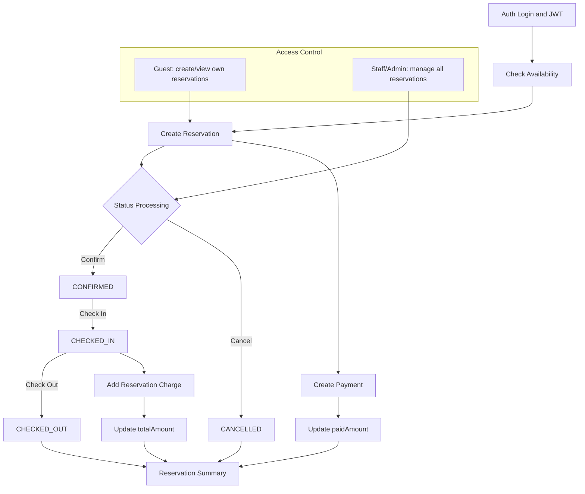

# Booking Functional Diagram

```mermaid
flowchart TD
    A[Auth Login and JWT] --> B[Check Availability]
    B --> C[Create Reservation]
    C --> D{Status Processing}

    D -->|Confirm| E[CONFIRMED]
    E -->|Check In| F[CHECKED_IN]
    F -->|Check Out| G[CHECKED_OUT]

    D -->|Cancel| H[CANCELLED]

    F --> I[Add Reservation Charge]
    C --> J[Create Payment]
    I --> K[Update totalAmount]
    J --> L[Update paidAmount]

    K --> M[Reservation Summary]
    L --> M
    G --> M
    H --> M

    subgraph Access Control
      N[Guest: create/view own reservations]
      O[Staff/Admin: manage all reservations]
    end

    N --> C
    O --> D
```

