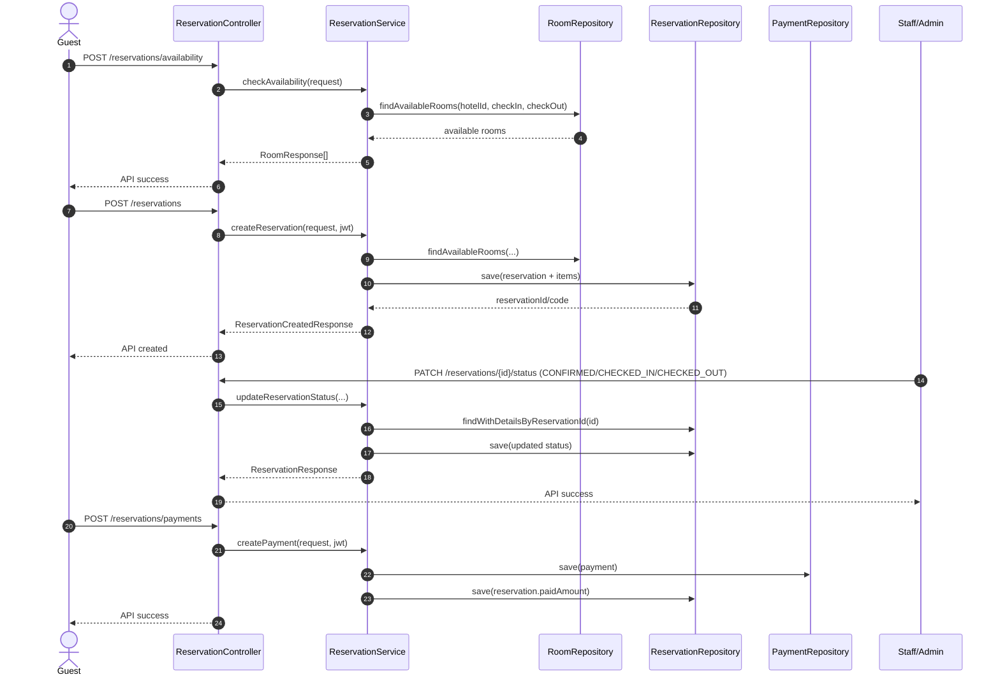

# Booking Sequence Diagram

```mermaid
sequenceDiagram
    autonumber
    actor Guest
    participant RC as ReservationController
    participant RS as ReservationService
    participant RR as RoomRepository
    participant RSR as ReservationRepository
    participant PR as PaymentRepository

    Guest->>RC: POST /reservations/availability
    RC->>RS: checkAvailability(request)
    RS->>RR: findAvailableRooms(hotelId, checkIn, checkOut)
    RR-->>RS: available rooms
    RS-->>RC: RoomResponse[]
    RC-->>Guest: API success

    Guest->>RC: POST /reservations
    RC->>RS: createReservation(request, jwt)
    RS->>RR: findAvailableRooms(...)
    RS->>RSR: save(reservation + items)
    RSR-->>RS: reservationId/code
    RS-->>RC: ReservationCreatedResponse
    RC-->>Guest: API created

    participant Staff as Staff/Admin
    Staff->>RC: PATCH /reservations/{id}/status (CONFIRMED/CHECKED_IN/CHECKED_OUT)
    RC->>RS: updateReservationStatus(...)
    RS->>RSR: findWithDetailsByReservationId(id)
    RS->>RSR: save(updated status)
    RS-->>RC: ReservationResponse
    RC-->>Staff: API success

    Guest->>RC: POST /reservations/payments
    RC->>RS: createPayment(request, jwt)
    RS->>PR: save(payment)
    RS->>RSR: save(reservation.paidAmount)
    RC-->>Guest: API success
```

